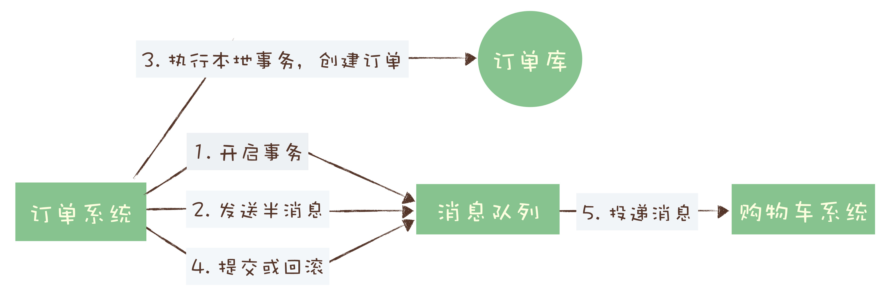
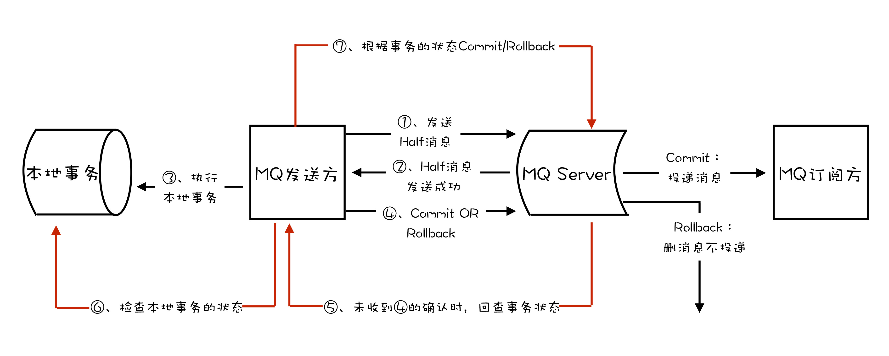

# 一、哪些问题适合使用消息队列来解决？

## 1. 异步处理

典型场景：秒杀系统

对于对于这 5 个步骤来说，能否决定秒杀成功，实际上只有风险控制和库存锁定这 2 个步骤。只要用户的秒杀请求通过风险控制，并在服务端完成库存锁定，就可以给用户返回秒杀结果了，对于后续的生成订单、短信通知和更新统计数据等步骤，并不一定要在秒杀请求中处理完成。

**这样做的好处是：**

- 可以更快地返回结果；
- 减少等待，自然实现了步骤之间的并发，提升系统总体的性能。

# 一、哪些问题适合使用消息队列来解决？

##  2. 流量控制

如何避免过多的请求压垮我们的秒杀系统？
**我们的设计思路是：使用消息队列隔离网关和后端服务，以达到流量控制和保护后端服务的目的。**

加入消息队列后，整个秒杀流程变为：

1. 网关在收到请求后，将请求放入请求消息队列；
2. 后端服务从请求消0息队列中获取 APP 请求，完成后续秒杀处理过程，然后返回结果。

   
   

**这种设计的优点是：**

能根据下游的处理能力自动调节流量，达到“**削峰填谷**”的作用。

但这样做同样是有**代价**的：

- 增加了系统调用链环节，导致总体的响应时延变长。
- 上下游系统都要将同步调用改为异步消息，增加了系统的复杂度。

# 一、哪些问题适合使用消息队列来解决？

##  2. 流量控制-令牌桶

**令牌桶控制流量的原理是**：单位时间内只发放固定数量的令牌到令牌桶中，规定服务在处理请求之前必须先从令牌桶中拿出一个令牌，如果令牌桶中没有令牌，则拒绝请求。这样就保证单位时间内，能处理的请求不超过发放令牌的数量，起到了流量控制的作用。

# 一、哪些问题适合使用消息队列来解决？

##  2. 流量控制

以上是常用的使用消息队列两种进行流量控制的设计方法，你可以根据各自的优缺点和不同的适用场景进行合理选择。

# 一、哪些问题适合使用消息队列来解决？

## 3. 服务解耦

再举一个电商的例子来说明解耦的**作用和必要性**。

我们知道订单是电商系统中比较核心的数据，当一个新订单创建时：

1. 支付系统需要发起支付流程；
2. 风控系统需要审核订单的合法性；
3. 客服系统需要给用户发短信告知用户；
4. 经营分析系统需要更新统计数据；
5. ……

所有的电商都选择用消息队列来解决类似的系统耦合过于紧密的问题。引入消息队列后，订单服务在订单变化时发送一条消息到消息队列的一个主题 Order 中，所有下游系统都订阅主题 Order，这样每个下游系统都可以获得一份实时完整的订单数据。

# 小结

以上就是消息队列最常被使用的三种场景：异步处理、流量控制和服务解耦。当然，消息队列的适用范围不仅仅局限于这些场景，还有包括：

- **作为发布 / 订阅系统实现一个微服务级系统间的观察者模式；**
- **连接流计算任务和数据；**
- **用于将消息广播给大量接收者。**

# 二、该如何选择消息队列？

## 选择消息队列产品的基本标准

1. 必须是开源的产品
2. 当下流行且社区活跃
3. 消息的可靠传递
4. Cluster
5. 性能

# 二、该如何选择消息队列？

## 可供选择的消息队列产品

### 1. RabbitMQ

首先，我们说一下老牌儿消息队列 RabbitMQ，俗称兔子 MQ。RabbitMQ 是使用一种比较小众的编程语言：Erlang 语言编写的，它最早是为电信行业系统之间的可靠通信设计的，也是少数几个**支持 AMQP 协议**的消息队列之一。

**轻量级、迅捷**，它的 Slogan，也就是宣传口号，也很明确地表明了 RabbitMQ 的特点：**Messaging that just works，**“**开箱即用的消息队列**”。

RabbitMQ 一个比较有特色的功能是**支持非常灵活的路由配置**，和其他消息队列不同的是，它在生产者（Producer）和队列（Queue）之间增加了一个 **Exchange 模块**，你可以理解为交换机。

**RabbitMQ 的客户端支持的编程语言大概是所有消息队列中最多的**

# 二、该如何选择消息队列？

## 可供选择的消息队列产品

### 1. RabbitMQ

接下来说下 RabbitMQ 的几个问题。

第一个问题是，**RabbitMQ 对消息堆积的支持并不好**，在它的设计理念里面，消息队列是一个管道，大量的消息积压是一种不正常的情况，应当尽量去避免。当大量消息积压的时候，会导致 RabbitMQ 的性能急剧下降。

第二个问题是，**RabbitMQ 的性能是我们介绍的这几个消息队列中最差的**，根据官方给出的测试数据综合我们日常使用的经验，依据硬件配置的不同，它大概每秒钟可以处理几万到十几万条消息。其实，这个性能也足够支撑绝大多数的应用场景了，不过，如果你的应用对消息队列的性能要求非常高，那不要选择 RabbitMQ。

最后一个问题是 **RabbitMQ 使用的编程语言 Erlang**，这个编程语言不仅是非常小众的语言，更麻烦的是，这个语言的学习曲线非常陡峭。大多数流行的编程语言，比如 Java、C/C++、Python 和 JavaScript，虽然语法、特性有很多的不同，但它们基本的体系结构都是一样的，你只精通一种语言，也很容易学习其他的语言，短时间内即使做不到精通，但至少能达到“会用”的水平。

# 二、该如何选择消息队列？

## 可供选择的消息队列产品

### 2. RocketMQ

RocketMQ 是阿里巴巴在 2012 年开源的消息队列产品，后来捐赠给 Apache 软件基金会，2017 正式毕业，成为 Apache 的顶级项目。阿里内部也是使用 RocketMQ 作为支撑其业务的消息队列，经历过多次“双十一”考验，它的性能、稳定性和可靠性都是值得信赖的。作为优秀的国产消息队列，近年来越来越多的被国内众多大厂使用。

**RocketMQ 就像一个品学兼优的好学生，有着不错的性能，稳定性和可靠性，具备一个现代的消息队列应该有的几乎全部功能和特性，并且它还在持续的成长中。**

RocketMQ 有非常**活跃的中文社区**，大多数问题你都可以找到中文的答案。

RocketMQ 对**在线业务**的响应时延做了很多的优化，大多数情况下可以做到毫秒级的响应，**如果你的应用场景很在意响应时延，那应该选择使用 RocketMQ。**

RocketMQ 的一个劣势是，作为国产的消息队列，相比国外的比较流行的同类产品，在国际上还没有那么流行，与周边生态系统的集成和兼容程度要略逊一筹。

# 二、该如何选择消息队列？

## 可供选择的消息队列产品

### 3. Kafka

Kafka 最早是由 LinkedIn 开发，目前也是 Apache 的顶级项目。Kafka 最初的设计目的是用于处理海量的日志。

**Kafka 与周边生态系统的兼容性是最好的没有之一，尤其在大数据和流计算领域，几乎所有的相关开源软件系统都会优先支持 Kafka。**

Kafka 使用 Scala 和 Java 语言开发，**设计上大量使用了批量和异步的思想**，这种设计使得 Kafka 能做到超高的性能。Kafka 的性能，尤其是异步收发的性能，是三者中最好的，但与 RocketMQ 并没有量级上的差异，大约每秒钟可以处理几十万条消息。

**但是 Kafka 这种异步批量的设计带来的问题是，它的同步收发消息的响应时延比较高**，因为当客户端发送一条消息的时候，Kafka 并不会立即发送出去，而是要等一会儿攒一批再发送，在它的 Broker 中，很多地方都会使用这种“**先攒一波再一起处理**”的设计。当你的业务场景中，每秒钟消息数量没有那么多的时候，Kafka 的时延反而会比较高。所以，**Kafka 不太适合在线业务场景。**

# 二、该如何选择消息队列？

## 第二梯队的消息队列

### 1. ActiveMQ

ActiveMQ 是最老牌的开源消息队列，是十年前唯一可供选择的开源消息队列，目前**已进入老年期，社区不活跃**。无论是功能还是性能方面，ActiveMQ 都与现代的消息队列存在明显的差距，它存在的意义仅限于兼容那些还在用的爷爷辈儿的系统。

### 2. ZeroMQ

严格来说 ZeroMQ 并不能称之为一个消息队列，而是一个**基于消息队列的多线程网络库**，如果你的需求是将消息队列的功能集成到你的系统进程中，可以考虑使用 ZeroMQ。

###  3. Pulsar

很多人可能都没听说过这个产品，Pulsar 是一个新兴的开源消息队列产品，最早是由 Yahoo 开发，目前处于成长期，流行度和成熟度相对没有那么高。与其他消息队列最大的不同是，**Pulsar 采用存储和计算分离的设计**，它有可能会引领未来消息队列的一个发展方向

# 二、该如何选择消息队列？

## 总结

选型建议:

1. 如果说，消息队列并不是你将要构建系统的主角之一，你对消息队列功能和性能都没有很高的要求，只需要一个**开箱即用易于维护的产品**，建使用 RabbitMQ。

2. 如果你的系统使用消息队列主要场景是处理**在线业务**，比如在交易系统中用消息队列传递订单，那 RocketMQ 的低延迟和金融级的稳定性是你需要的。

3. 如果你需要**处理海量的消息**，**像收集日志、监控信息或是前端的埋点这类数据**，或是你的应用场景大量使用了**大数据、流计算相关**的开源产品，那 Kafka 是最适合的消息队列。

# 三、如何利用事务消息实现分布式事务？

**消息队列中的“事务”，主要解决的是消息生产者和消息消费者的数据一致性问题。**

依然拿我们熟悉的电商来举个例子。

对于订单系统来说，它创建订单的过程中实际上执行了 2 个步骤的操作：

1. 在订单库中插入一条订单数据，创建订单；
2. 发消息给消息队列，消息的内容就是刚刚创建的订单。

购物车系统订阅相应的主题，接收订单创建的消息，然后清理购物车，在购物车中删除订单中的商品。

# 三、如何利用事务消息实现分布式事务？

在分布式系统中，上面提到的这些步骤，**任何一个步骤都有可能失败**，如果不做任何处理，那就有可能出现订单数据与购物车数据不一致的情况，比如说：

- 创建了订单，没有清理购物车；
- 订单没创建成功，购物车里面的商品却被清掉了。

那我们需要解决的问题可以总结为：**在上述任意步骤都有可能失败的情况下，还要保证订单库和购物车库这两个库的数据一致性。**  我们希望这些更新操作**要么都成功，要么都失败。

# 三、如何利用事务消息实现分布式事务？

一个严格意义的事务实现，应该具有 4 个属性：**原子性、一致性、隔离性、持久性**。这四个属性通常称为 ACID 特性。

- 原子性，是指一个事务操作不可分割，要么成功，要么失败，不能有一半成功一半失败的情况。

- 一致性，是指这些数据在事务执行完成这个时间点之前，读到的一定是更新前的数据，之后读到的一定是更新后的数据，不应该存在一个时刻，让用户读到更新过程中的数据。

- 隔离性，是指一个事务的执行不能被其他事务干扰。即一个事务内部的操作及使用的数据对正在进行的其他事务是隔离的，并发执行的各个事务之间不能互相干扰，这个有点儿像我们打网游中的副本，我们在副本中打的怪和掉的装备，与其他副本没有任何关联也不会互相影响。

- 持久性，是指一个事务一旦完成提交，后续的其他操作和故障都不会对事务的结果产生任何影响。

# 三、如何利用事务消息实现分布式事务？

大部分传统的单体关系型数据库都完整的实现了 ACID，但是，**对于分布式系统来说，严格的实现 ACID 这四个特性几乎是不可能的，或者说实现的代价太大，大到我们无法接受。**

在实际应用中，比较常见的分布式事务实现有 **2PC（Two-phase Commit，也叫二阶段提交）、TCC(Try-Confirm-Cancel) 和事务消息。**每一种实现都有其特定的使用场景，也有各自的问题，都不是完美的解决方案。

# 三、如何利用事务消息实现分布式事务？

## 消息队列是如何实现分布式事务的？

事务消息需要消息队列提供相应的功能才能实现，Kafka 和 RocketMQ 都提供了事务相关功能。

回到订单和购物车这个例子，我们一起来看下如何用消息队列来实现分布式事务。

首先，订单系统在消息队列上开启一个事务。然后订单系统给消息服务器发送一个**“半消息”**，这个半消息不是说消息内容不完整，它包含的内容就是完整的消息内容，半消息和普通消息的唯一区别是，**在事务提交之前，对于消费者来说，这个消息是不可见的。**

如果在第四步 **提交事务消息时失败了怎么办？**

# 三、如何利用事务消息实现分布式事务？

## 消息队列是如何实现分布式事务的？

**Kafka 的解决方案比较简单粗暴，直接抛出异常，让用户自行处理**。

RocketMQ  中，增加了**事务反查的机制**来解决事务消息提交失败的问题。如果 Producer 也就是订单系统，在提交或者回滚事务消息时发生网络异常，RocketMQ 的 Broker 没有收到提交或者回滚的请求，**Broker 会定期去 Producer 上反查这个事务对应的本地事务的状态，然后根据反查结果决定提交或者回滚这个事务。**

为了支撑这个事务反查机制，我们的业务代码需要实现一个反查本地事务状态的接口，告知 RocketMQ 本地事务是成功还是失败。

这个反查本地事务的实现，并不依赖消息的发送方，也就是订单服务的某个实例节点上的任何数据。这种情况下，即使是发送事务消息的那个订单服务节点宕机了，RocketMQ 依然可以通过其他订单服务的节点来执行反查，确保事务的完整性。

# 三、如何利用事务消息实现分布式事务？

综合上面讲的通用事务消息的实现和 RocketMQ 的事务反查机制，使用 RocketMQ 事务消息功能实现分布式事务的流程如下图：

# 思考：

为什么先①提交半消息，并且收到②，再③执行本地事务？

# 三、如何利用事务消息实现分布式事务？

RocketMQ 实现订单购物车的例子：

1. 首先通过`producer.sendMessageInTransaction()`方法发送一个半消息给MQ

2. 此时会在`TransactionListener`中的`executeLocalTransaction()`方法阻塞，然后在这个方法里面进行订单创建并提交本地事务，如果commit成功，则返回COMMIT状态，否则是ROLLBACK状态，如果正常返回COMMIT或者ROLLBACK的话，不会存在第3步的反查情况。

3. 如果上面的本地事务提交成功以后，此节点突然断电，那么`checkLocalTransaction()`反查方法就会在某个时候被MQ调用，此方法会根据消息中的订单号去数据库确认订单是否存在，存在就返回COMMIT状态，否则是ROLLBACK状态。

4. 购物车在另外一个项目中，反正只要收到MQ的消息就将本次订单的商品从购物车中删除即可。

# 四、如何确保消息不会丢失？

# 五、如何处理消费过程中的重复消息？

# 六、消息积压了该如何处理
